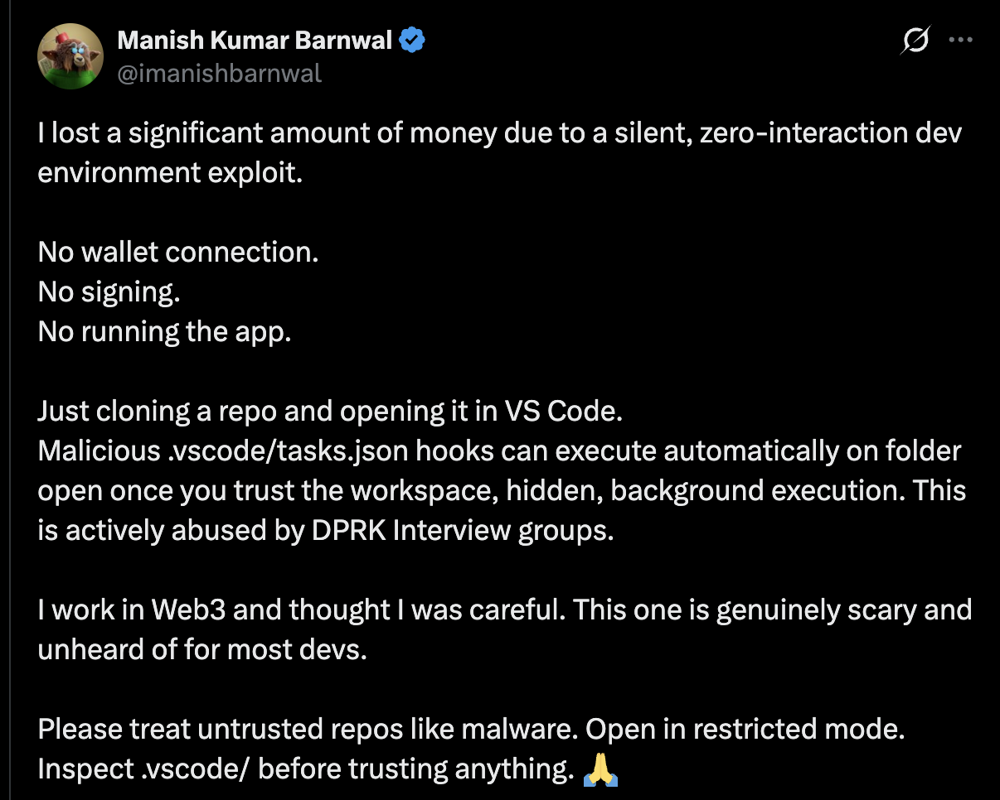

# RepoScan

**"RepoScan warns you before a repo can steal from you."**

A VS Code extension that scans repositories for wallet-drain, fund exfiltration, and malicious execution patterns **before you trust them**.

---

## 💸 This Is Real. You Can Be Drained.

<p align="center">
  
</p>

> *"I lost a significant amount of money due to a silent, zero-interaction dev environment exploit.*
>
> *No wallet connection. No signing. No running the app.*
>
> *Just cloning a repo and opening it in VS Code.*
>
> *Malicious `.vscode/tasks.json` hooks can execute automatically on folder open once you trust the workspace, hidden, background execution. This is actively abused by DPRK Interview groups."*
>
> — [@imanishbarnwal](https://x.com/imanishbarnwal/status/2010302090137260426), Jan 2026

**This isn't theoretical.** Developers are losing real money right now. The attack requires zero interaction — just opening a folder and clicking "Trust" is enough to drain your wallet.

```
┌─────────────────────────────────────────────────────────────────┐
│  THE ATTACK                                                      │
├─────────────────────────────────────────────────────────────────┤
│                                                                  │
│  1. Clone repo          →  Looks normal                         │
│  2. Open in VS Code     →  "Do you trust the authors?"          │
│  3. Click "Trust"       →  💀 .vscode/tasks.json executes       │
│  4. Nothing visible     →  Runs hidden in background            │
│  5. Wallet drained      →  Keys exfiltrated, funds gone         │
│                                                                  │
│  Total user interaction: ONE CLICK                               │
│                                                                  │
└─────────────────────────────────────────────────────────────────┘
```

**RepoScan was built to stop this.**

---

## 🚨 Why RepoScan?

Developers have lost significant funds to malicious repositories. Attack vectors include:

- **VS Code `tasks.json` auto-execution** — Code runs the moment you trust a workspace
- **npm `postinstall` scripts** — Malware executes during `npm install`
- **Python `setup.py` hooks** — Malicious code runs during `pip install`
- **Obfuscated payloads** — Hidden code that steals keys and drains wallets

These attacks are actively used by nation-state actors (DPRK "Interview" groups) targeting Web3 developers.

## ✨ Features

- **Zero-interaction attack detection** — Catches `tasks.json` auto-run exploits
- **Wallet-drain pattern recognition** — Identifies signing, approval, and key exfiltration
- **Install hook scanning** — Detects malicious npm/pip install scripts
- **Obfuscation detection** — Flags hidden and encoded payloads
- **Works in Restricted Mode** — Scan BEFORE trusting the workspace
- **100% local** — No code leaves your machine, no account required

## 📦 Installation

### From VS Code Marketplace
[**Install RepoScan**](https://marketplace.visualstudio.com/items?itemName=bizmindx.reposcan) or search for "RepoScan" in the Extensions view (`Cmd+Shift+X`).

### From Source
```bash
cd reposcan
npm install
npm run build
```

Then press F5 to launch the extension in development mode.

## 🔍 Usage

1. Clone a repository
2. Open it in VS Code — **don't trust it yet**
3. Run `RepoScan: Scan Repository` from the Command Palette (`Cmd+Shift+P`)
4. Review the results before deciding to trust

### Verdict Levels

- 🚨 **High Risk** — Known or strong drain indicators. DO NOT TRUST.
- ⚠️ **Medium Risk** — Suspicious patterns. Review carefully.
- ✅ **Low Risk** — No critical issues found.

## 🛡️ What RepoScan Detects

### VS Code Configuration (Critical Priority)
- `tasks.json` with `runOn: folderOpen` (auto-execution)
- Hidden terminal output (`reveal: never`)
- Background execution (`isBackground: true`)
- Base64-encoded commands
- Malicious `settings.json` and `launch.json`

### JavaScript/TypeScript
- `postinstall`, `preinstall` scripts
- `eval()`, `Function()`, dynamic execution
- Wallet signing patterns
- Unlimited token approvals
- Private key handling
- Obfuscated code

### Python
- `setup.py` with custom `cmdclass`
- `exec()`, `eval()` in install hooks
- Environment variable harvesting
- Private key handling

### Shell Scripts
- `curl | bash` patterns
- Reverse shell indicators
- Persistence mechanisms
- Credential exfiltration

### Repository Heuristics
- Minified code in source directories
- Binary blobs
- Typosquatted package names
- Hidden executables

## ⚠️ Limitations

RepoScan:
- Does **not** execute code
- Cannot detect **all** attacks
- Does **not** replace professional audits
- **Reduces risk**, does not eliminate it

Always exercise caution with unfamiliar repositories.

## 🤝 Contributing

RepoScan is open source (AGPL-3.0). Contributions welcome!

```bash
# Clone
git clone https://github.com/bizmindx/reposcan
cd reposcan

# Install
npm install

# Build
npm run build

# Test
npm test

# Watch mode
npm run watch
```

### Adding Rules

Rules are defined in `src/rules/`. Each rule specifies:
- `id` — Unique identifier
- `name` — Short description
- `description` — Detailed explanation shown to users
- `severity` — `high`, `medium`, `low`, or `info`
- `filePatterns` — Files to scan
- `detect` — Detection method (regex, json-path, etc.)

## 📄 License

AGPL-3.0 — See [LICENSE](LICENSE) for details.

---

**Stay safe. Scan before you trust.**

Built by [@bizmindx](https://x.com/bizmindx)
